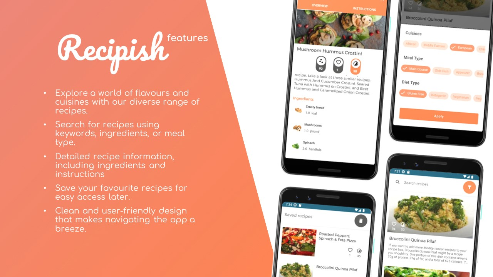

<h1 align="center"> Recipish: Your Ultimate Food Recipe App </h1>

## Introduction
Welcome to the README for Recipish, an Android application built to provide you with a vast array of food recipes right at your fingertips. Whether you're a seasoned chef or a cooking novice, Recipish has something for everyone.

## Features
- Browse through thousands of recipes
- Save your favorite recipes for quick access
- Filter recipes based on dietary restrictions, meal type, and more
- Offline availability of cached recipes
- And many more..

## Technology Stack

### Libraries and Frameworks
- **Dagger-Hilt**: For Dependency Injection
- **Retrofit**: For making HTTP requests
- **DataStore Preferences**: For storing user preferences and settings
- **Data Binding Library**: For UI data manipulation
- **Shimmer**: For providing a loading effect
- **ROOM Database**: For offline data storage
- **Coil Image Library**: For image rendering
- **Lifecycle**: For component lifecycle management
- **RecyclerView**: For list data representation

## Installation
Follow these steps to get the app up and running on your Android device:

1. Clone the repository: `git clone https://github.com/your-username/Recipish.git`
2. Open the project with Android Studio
3. Build the project and run it on an Android device or emulator

## API Reference
The recipes data are fetched from the Spoonacular API.

## License
This project is licensed under the MIT License - see the [LICENSE.md](LICENSE.md) file for details.

## Acknowledgments
Special thanks to the creators and maintainers of the various libraries and technologies that make this app what it is.

